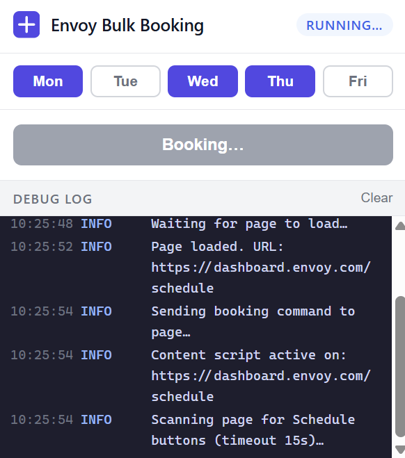

# Envoy Bulk Desk Booking

A Chrome extension that books all your desks on [Envoy](https://dashboard.envoy.com) for the week with a single click — no manual scheduling required.




---

## What it does

The extension opens the Envoy schedule page in a background tab, finds every available **Schedule** / **Book Desk** button, and clicks each one in sequence — including handling any confirmation modals. Progress is shown live in the popup with a booking summary when complete.

---

## Assumptions

- **You are already logged in to Envoy in Chrome.** The extension does not handle authentication. If you are not signed in, the background tab will be redirected to the login page and the booking will fail with an error in the debug log.
- **Envoy will allocate a desk for you.** The extension clicks the Schedule button for each available slot; it does not select a specific desk. Your Envoy workspace must have auto-assignment or a pre-assigned desk configured.
- **Desks are available to book.** Slots that are already booked, full, or disabled are skipped automatically.
- **You are using Chrome** (or a Chromium-based browser such as Edge or Brave) with support for Manifest V3 extensions.

---

## Installation (unpacked / developer mode)

Chrome extensions can be loaded directly from source without publishing to the Chrome Web Store.

1. **Clone or download this repository.**

   ```bash
   git clone https://github.com/your-username/envoy-bulk-bookings.git
   ```

2. **Open Chrome's extension manager.**

   Navigate to `chrome://extensions` in your address bar.

3. **Enable Developer mode.**

   Toggle the **Developer mode** switch in the top-right corner of the extensions page.

4. **Load the unpacked extension.**

   Click **Load unpacked** and select the root folder of this repository (the folder that contains `manifest.json`).

5. **Pin the extension (optional but recommended).**

   Click the puzzle-piece icon in the Chrome toolbar, find **Envoy Bulk Booking**, and click the pin icon so the popup is always one click away.

---

## Usage

1. Make sure you are signed in to [dashboard.envoy.com](https://dashboard.envoy.com) in Chrome.
2. Click the **Envoy Bulk Booking** icon in your toolbar.
3. Select which days of the week you want to book (Mon–Fri are all active by default).
4. Click **Book All Desks**.
5. The extension opens the Envoy schedule page in a background tab, books each available desk, and closes the tab when done.
6. A **Booking Summary** table and a **Debug Log** are shown in the popup once the run completes.

---

## Permissions

| Permission | Why it is needed |
|---|---|
| `activeTab` | Communicate with the currently active Envoy tab |
| `tabs` | Open a background tab to the schedule page and close it when done |
| `storage` | Persist your day-of-week selection and live booking state across popup opens |
| `host_permissions: https://dashboard.envoy.com/*` | Inject the content script that finds and clicks the Schedule buttons |

No data ever leaves your browser. The extension communicates only with `dashboard.envoy.com`.

---

## Troubleshooting

| Symptom | Likely cause | Fix |
|---|---|---|
| "Redirected to login page" error | Not signed in to Envoy | Sign in at [dashboard.envoy.com](https://dashboard.envoy.com) then try again |
| "No Schedule buttons found" warning | Desks are already booked, or the page layout changed | Check the Envoy schedule page manually; the extension logs the buttons it finds |
| Booking stops part-way through | A modal appeared that the extension couldn't auto-dismiss | Check the Debug Log for details; report the modal text as a GitHub issue |
| Extension not visible in toolbar | Not pinned | Go to `chrome://extensions`, find the extension, and ensure it is enabled |

---

## Contributing

Pull requests are welcome. For significant changes, please open an issue first to discuss what you would like to change.

---

## Disclaimer

This project is not affiliated with, endorsed by, or supported by Envoy. It automates actions in your own browser session on your behalf. Use it in accordance with your organisation's policies.
