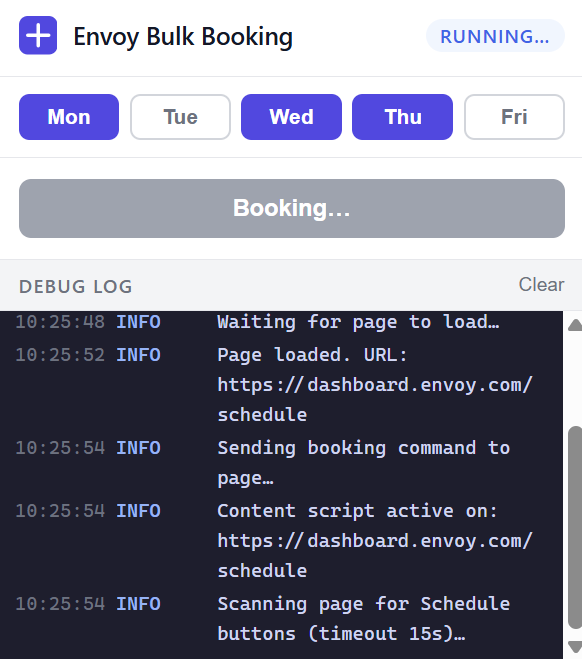

# Envoy Bulk Desk Booking

A Chrome extension that books all your desks on [Envoy](https://dashboard.envoy.com) for the week with a single click — no manual scheduling required.




---

## What it does

The extension opens the Envoy schedule page in a background tab, finds every available **Schedule** / **Book Desk** button, and clicks each one in sequence — including handling any confirmation modals. Progress is shown live in the popup with a booking summary when complete. If the extension detects a login redirect, it can automatically submit your corporate email and rely on your browser's existing SSO session to re-authenticate — no manual sign-in needed.

It can run both manually and automatically:

- **Manual run:** from the popup when you click **Book All Desks**.
- **Automatic daily run:** at **11:00 AM local time** via a Chrome alarm.
- **Startup catch-up run:** when Chrome starts **after 11:00 AM**, it runs once for the day if it has not already run.

---

## Assumptions

- **Your browser has an active corporate SSO session.** If you configure your corporate email in Settings (gear icon), the extension can automatically re-authenticate when Envoy's login page appears. Without a configured email, a login redirect will fail with an error in the debug log.
- **Your corporate SSO does not require interactive MFA after email submission.** The extension submits your email and waits for the SSO provider to redirect back automatically. If your identity provider prompts for a password or second factor, auto-login will fail.
- **Envoy will allocate a desk for you.** The extension clicks the Schedule button for each available slot; it does not select a specific desk. Your Envoy workspace must have auto-assignment or a pre-assigned desk configured.
- **Desks are available to book.** Slots that are already booked, full, or disabled are skipped automatically.
- **You are using Chrome** (or a Chromium-based browser such as Edge or Brave) with support for Manifest V3 extensions.

---

## Installation (unpacked / developer mode)

Chrome extensions can be loaded directly from source without publishing to the Chrome Web Store.

1. **Clone or download this repository.**

   ```bash
   git clone https://github.com/your-username/envoy-bulk-bookings.git
   ```

2. **Open Chrome's extension manager.**

   Navigate to `chrome://extensions` in your address bar.

3. **Enable Developer mode.**

   Toggle the **Developer mode** switch in the top-right corner of the extensions page.

4. **Load the unpacked extension.**

   Click **Load unpacked** and select the root folder of this repository (the folder that contains `manifest.json`).

5. **Pin the extension (optional but recommended).**

   Click the puzzle-piece icon in the Chrome toolbar, find **Envoy Bulk Booking**, and click the pin icon so the popup is always one click away.

---

## Usage

1. **(First time)** Click the **gear icon** (⚙) in the popup and enter your corporate email to enable auto-login. This only needs to be done once.
2. Make sure you are signed in to your corporate identity provider in Chrome (the extension will handle Envoy login automatically).
3. Click the **Envoy Bulk Booking** icon in your toolbar.
4. Select which days of the week you want to book (Mon–Fri are all active by default).
5. Click **Book All Desks**.
6. The extension opens the Envoy schedule page in a background tab, books each available desk, and closes the tab when done.
7. A **desktop notification** appears when the run finishes (success, nothing to book, or error).
8. A **Booking Summary** table and a **Debug Log** are shown in the popup once the run completes.

---

## Settings

Click the **gear icon** (⚙) in the popup to open the Settings page.

| Setting | Purpose |
|---|---|
| **Corporate email** | Your Envoy / corporate SSO email address. When set, the extension auto-submits this email if it encounters Envoy's login page, allowing your browser's existing SSO session to complete authentication automatically. |

> **Note:** Your email is stored in plain text in Chrome's local extension storage. Do not use this on a shared or managed computer.

---

## Permissions

| Permission | Why it is needed |
|---|---|
| `activeTab` | Communicate with the currently active Envoy tab |
| `tabs` | Open a background tab to the schedule page and close it when done |
| `storage` | Persist your day-of-week selection and live booking state across popup opens |
| `notifications` | Show a desktop notification when booking completes, fails, or finds nothing to book |
| `host_permissions: https://dashboard.envoy.com/*` | Inject the content script that finds and clicks the Schedule buttons |
| `alarms` | Schedule the automatic daily booking run and the startup catch-up check |
| `scripting` | Inject the auto-login script into the Envoy login page when re-authentication is needed |

No data ever leaves your browser. The extension communicates only with `dashboard.envoy.com`.

---

## Troubleshooting

| Symptom | Likely cause | Fix |
|---|---|---|
| "Redirected to login page" error | Email not configured for auto-login | Open Settings (gear icon) and save your corporate email to enable auto-login |
| "No Schedule buttons found" warning | Desks are already booked, or the page layout changed | Check the Envoy schedule page manually; the extension logs the buttons it finds |
| Booking stops part-way through | A modal appeared that the extension couldn't auto-dismiss | Check the Debug Log for details; report the modal text as a GitHub issue |
| Extension not visible in toolbar | Not pinned | Go to `chrome://extensions`, find the extension, and ensure it is enabled |
| "Auto-login failed: email field not found" | Envoy's login page layout changed | Report the issue on GitHub; the extension may need updated selectors |
| "Auto-login failed: still on login page after SSO redirect" | Corporate SSO session expired or MFA is required | Sign in to your corporate identity provider in Chrome first, then retry |
| Desktop notification doesn't appear | Windows Do Not Disturb is on, or Chrome is blocked in Windows notification settings | Check Settings → System → Notifications: turn off Do not disturb and ensure Google Chrome is enabled in the app list |

---

## Contributing

Pull requests are welcome. For significant changes, please open an issue first to discuss what you would like to change.

---

## Disclaimer

This project is not affiliated with, endorsed by, or supported by Envoy. It automates actions in your own browser session on your behalf. Use it in accordance with your organisation's policies.
